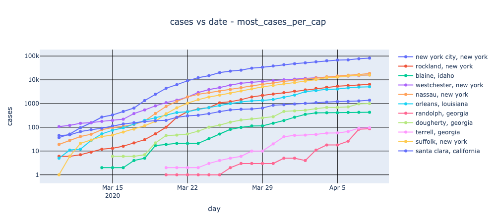

# Rob's COVID-19 Analysis Notebook
A jupyter notebook to analyze and plot the New York Times
[COVID-19 per-county data](https://github.com/nytimes/covid-19-data).

The analysis also uses population estimates per county from the US Census Data, taken from
the [US Census Website](https://www.census.gov/newsroom/press-kits/2020/pop-estimates-county-metro.html).
Specifically, we are using the dataset CO-EST2019-ANNRES.

This data is used to compute the number of cases and deaths per capita.

## Organization
The analysis consists of a jupyter notebook (analyze-nytimes-covid-county.ipynb) and rycovid.py, which contains associated functions.

* Load the data: the NYT data is downloaded directly from the github raw view. The census data, which is static, is stored in a Excel spreadsheet in the same directory as the notebook.
* Normalize the data: reformat the data sets so that both sets have matching county and state designations.
* Manipulation: compute, filter, and sort the values of interest
* Plots

## Use
1. Start up jupyter notebook.
1. Open analyze-nytimes-covid-county.ipynb
1. Select Cells->Run All
* Alternatively, type *Cntrl-Enter* on each cell to run it individually.

## Customization 
Variables in **ALL CAPS** are meant to be user parameters. For example, **START_DATE** specifies the starting date for analysis and plots.

